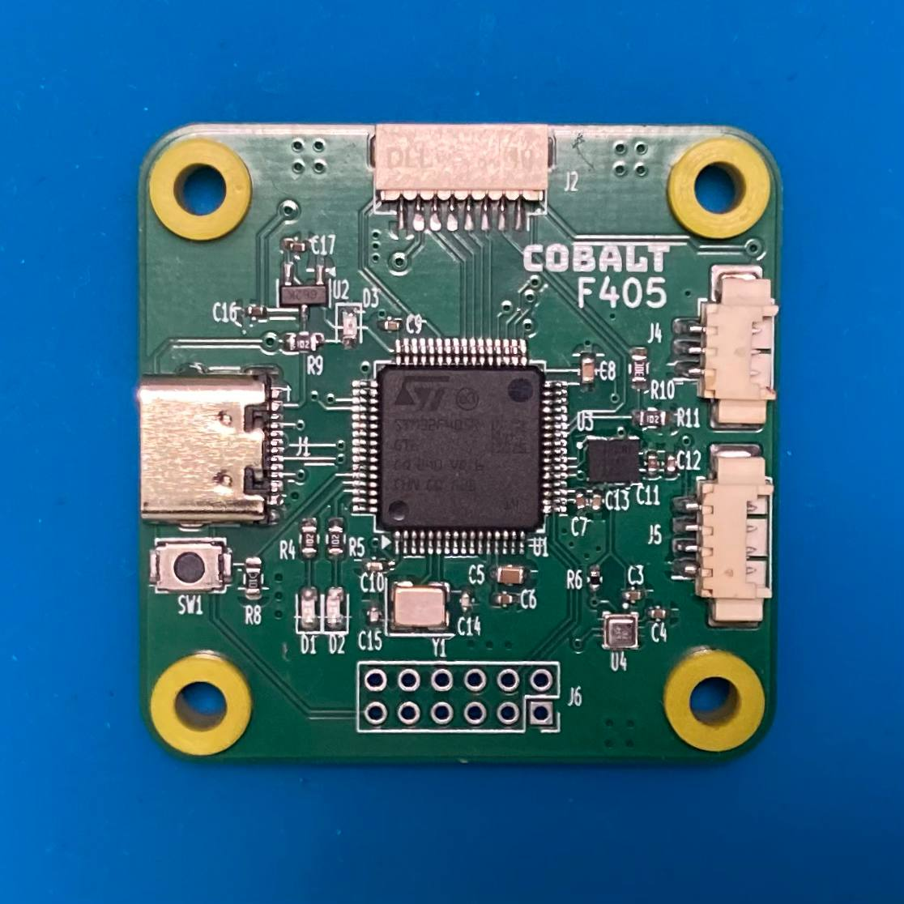
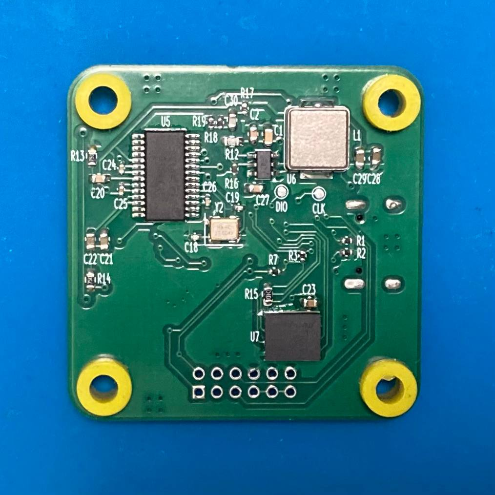
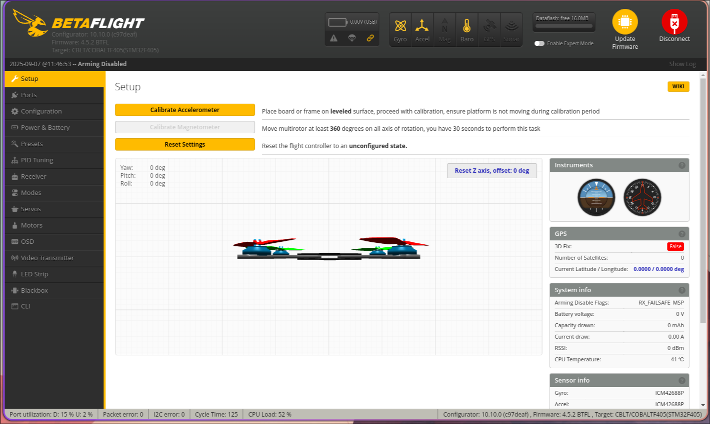
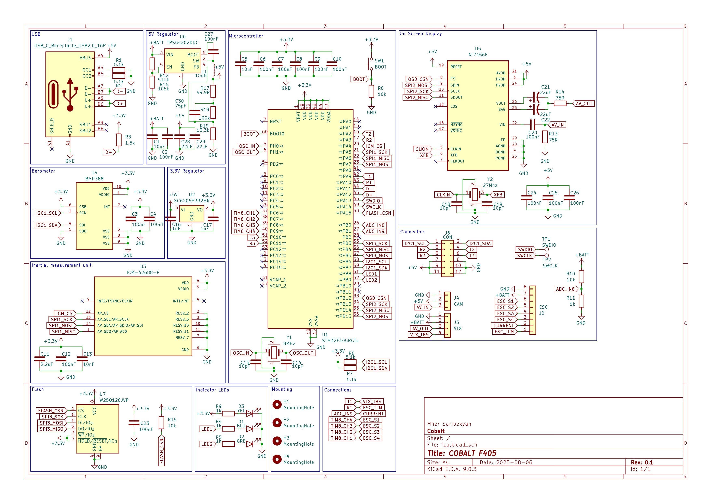
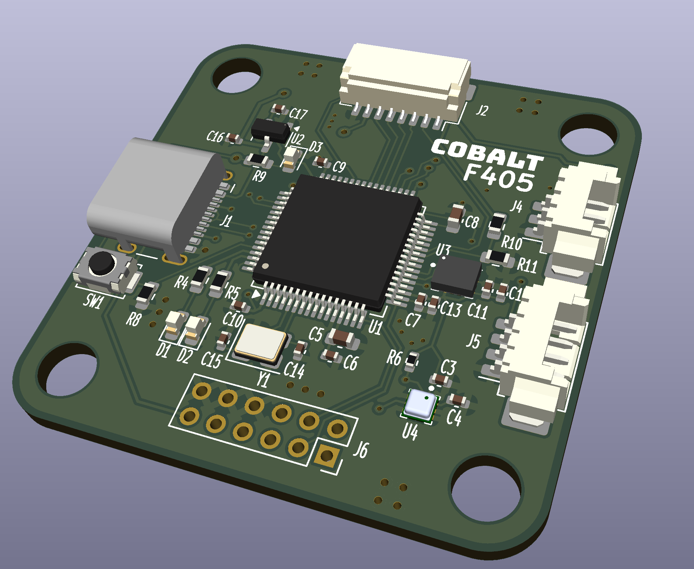

# Cobalt F405

## An open source flight controller based on the STM32F405 microcontroller

Custom designed flight controller for quadcopters and more.

## Features

Cobalt F405 flight controller has the following features:
- 4 motor outputs
- barometer and blackbox
- analog on-screen display
- easy-to-use connectors for camera and VTx
- USB Type-C connector for configuration
- high power 5 volt regulator

## Firmware

The flight controller was tested with the [Betaflight](https://github.com/betaflight/betaflight) firmware.

## Designing

KiCad was used for designing the schematic and the PCB.

### Schematic

### PCB 3D model

## Further improvements

### Microcontroller

Although the STM32F405 is still a good choice for flight controllers today, other more powerful microcontrollers also exist that are more powerful. [Betaflight guidlines](https://betaflight.com/docs/development/manufacturer/manufacturer-design-guidelines) suggest not using more than 4 motor outputs for STM32F4 or STM32F7 type microcontrollers.

### PCB

Two layer PCB is fine, however going to a four layer PCB with ground planes inside would reduce electrical noise, which would benefit the microcontroller and the on-board sensors.

### 9 volt regulator

Some external peripherals require higher voltage than 5 volts, however cannot accept 25 volts straight from a 6S battery. A 9 volt regulator can be added to solve this issue.

### More pads and connectors

More pads on the PCB would make it more flexible and easier to use in application. Camera and VTx connectors can be moved to more suitable locations and a connector for the radio receiver could be added.