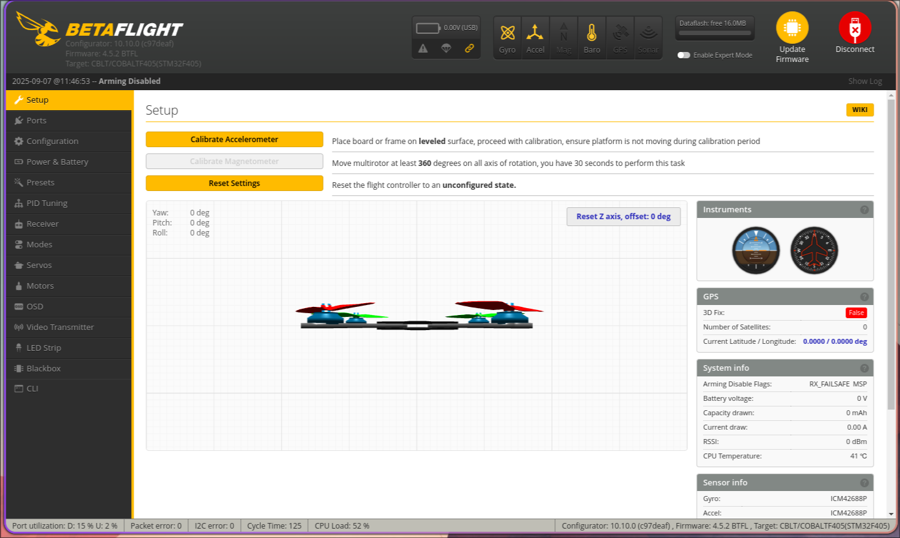

# The firmware

The [Betaflight](https://github.com/betaflight/betaflight) firmware was used and tested for the flight controller. The compiled .hex file can be used to flash the firmware, however the configuration files are also avaible, in case you want to compile yourself.

## How to flash

The easiest way of flashing is using the STM32CubeProgrammer, however other methods also exist e.g. using [stlink utility](https://github.com/stlink-org/stlink) or [OpenOCD](https://github.com/openocd-org/openocd).

### Step 1
Install [STM32CubeProgrammer](https://www.st.com/en/development-tools/stm32cubeprog.html). 

### Step 2
While holding the button on the flight controller plug the USB-C cable, connect to the computer and release the button. This puts the microcontroller in DFU mode and allows flashing over USB.

### Step 3

Open STM32CubeProgrammer and from the dropdown select USB, then a device should appear in the Port section. If not, redo the Step 2, until it appears.

Click connect.

### Step 3

Go the the Erasing & Programming tab. Click on Full chip erase.

After the chip erase, select the .hex file included in the repository and click Start Programming. Wait until the firware is completely flashed, it may take a while.

### Done

Unplug and replug the USB cable. Now you should be able to connect to it using the [Betaflight App](https://github.com/betaflight/betaflight-configurator).

