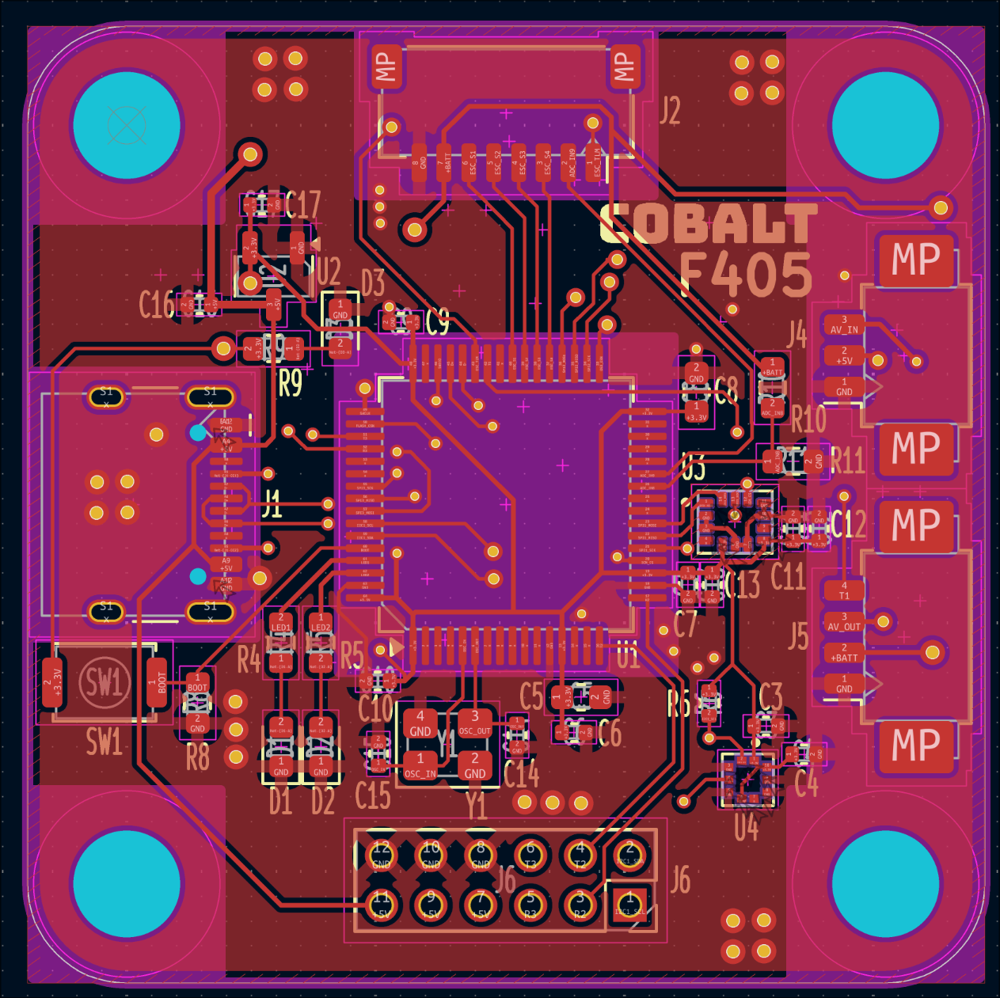
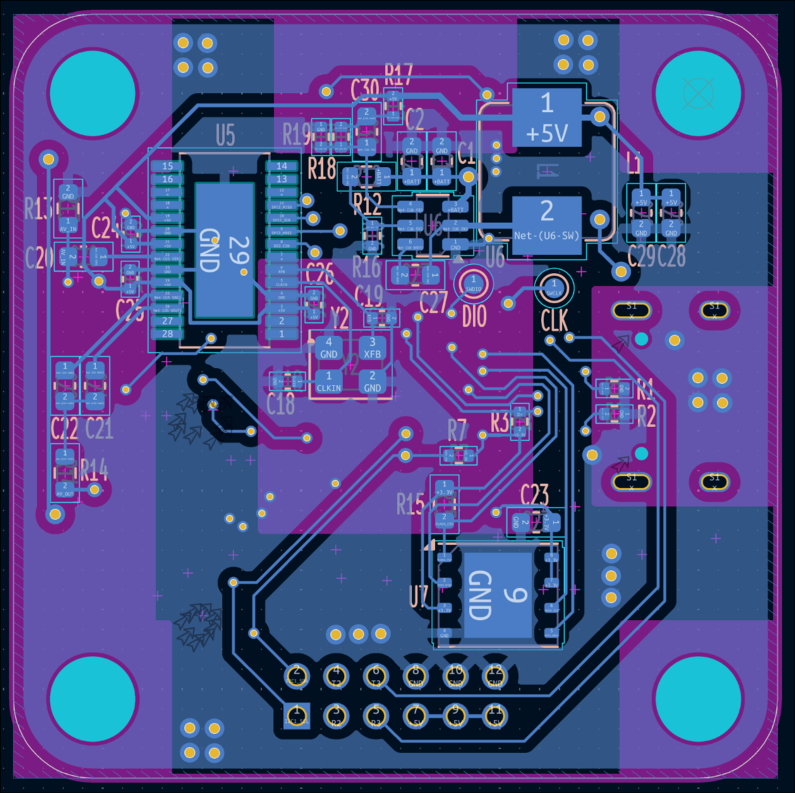

# The hardware

The PCB was design using [KiCad](https://gitlab.com/kicad/code/kicad), an open source schematic and PCB design software.

## Microcontroller: STM32F405RGT6

Betaflight has a list of supported microcontrollers and the STM32F405RGT6, because it is the most common and economical choice while providing enough performance.

## Inertial measurement unit: ICM-42688-P

The [Betaflight Flight Controller Manufacturer Design Guidelines](https://betaflight.com/docs/development/manufacturer/manufacturer-design-guidelines) strongly recommends against using the MPU6000 as it is end-of-life. Instead ICM-42688-P is suggested.

## Barometer: BMP388

Newer model of the BMP180 and BMP280 barometers.

## Blackbox: W25Q128JVP

Winbond W25Q128JVPIQ is a cheap and common 16 MB NOR Flash chip, with a small WSON-8 footprint.

## On-screen display: AT7456E

The flight controller has an on-screen display, for use with analog video. AT7456E is the standard choice.

## Connectors

An 8 pin JST connector is the standard for connecting to the ESC. Telemetry data is connected to UART 1 RX. The two Molex PicoBlade connectors are for the camera and the video transmitter (VTx). The camera connector passes 5 volt power, while the VTx connector passes battery power for more powerful VTx and also has a SmartAudio pin connected to UART 1 TX.

## UART, I2C and power outputs

UARTs 2 and 3 are available on the solder points, along with the I2C bus and three pairs of 5 volt and ground connections.

## PCB

## Front layers

### Back layers

